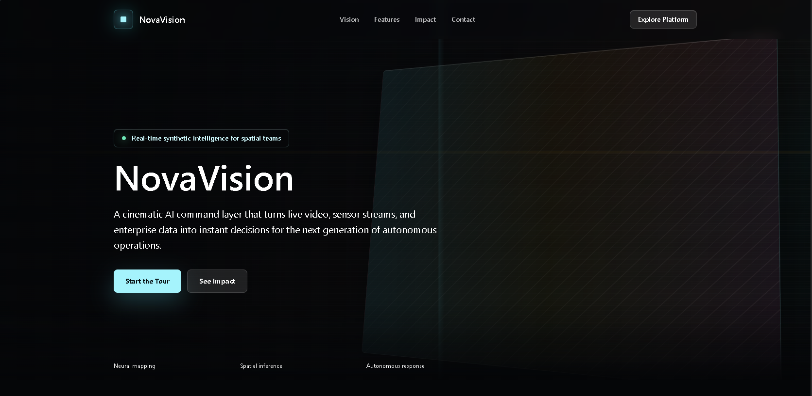
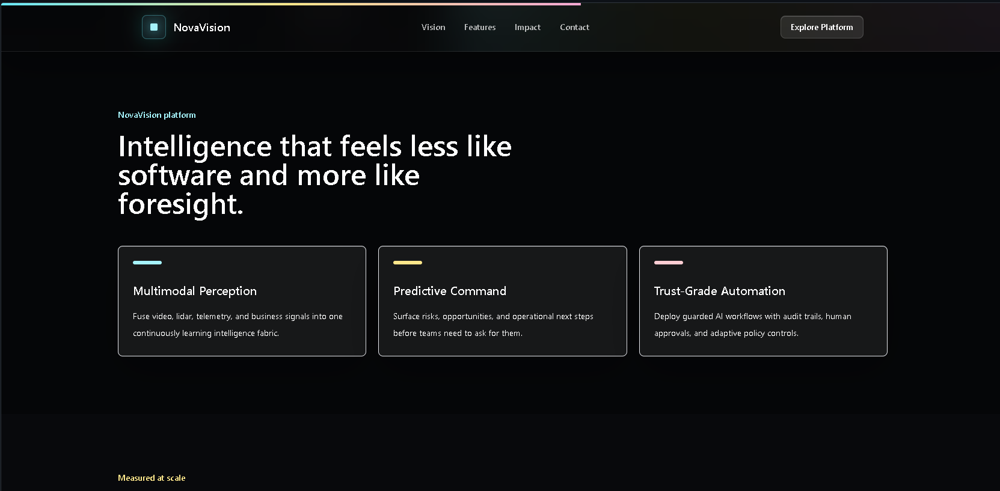
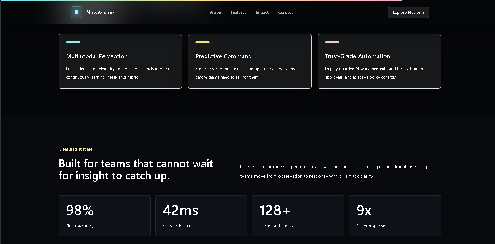
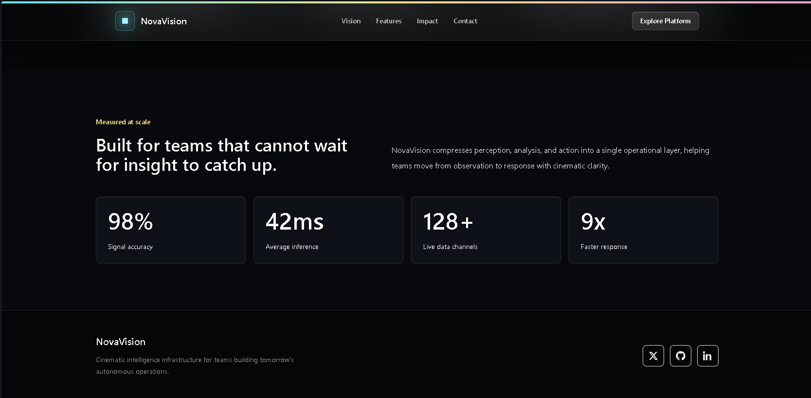

# NovaVision – Cinematic AI Landing Page

## Project Overview

NovaVision is a modern cinematic landing page for a fictional AI company. The project showcases premium UI design, smooth animations, responsive layouts, and interactive user experiences using modern frontend technologies.

## Features

- Sticky transparent navigation bar
- Smooth scrolling between sections
- Full-screen animated hero section
- Glassmorphism feature cards
- Animated statistics section
- Hover effects and interactive elements
- Fully responsive design for all devices
- Elegant footer with social links

## Tech Stack

- React
- Vite
- Tailwind CSS
- Framer Motion

## Installation

```bash
npm install
npm run dev
```

Build for production:

```bash
npm run build
```

## Project Structure

```text
src/
├── components/
│   ├── Navbar.jsx
│   ├── Hero.jsx
│   ├── Features.jsx
│   ├── Stats.jsx
│   └── Footer.jsx
├── App.jsx
├── main.jsx
└── styles.css
```

## Screenshots

### Hero Section



---

### Features Section



---

### Statistics Section



---

### Footer

